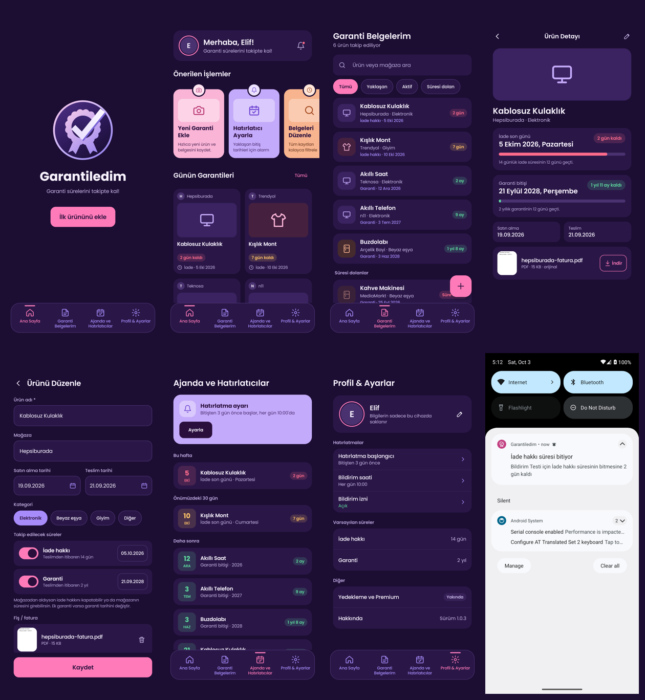

# Garantiledim

Satın alınan ürünlerin iade hakkı ve garanti sürelerini tek yerde takip eden Android uygulaması. Hesap ya da sunucu gerektirmez; tüm veriler cihazda tutulur.

- Ürün gereksinimleri ve tasarım kuralları: [`SPEC.md`](SPEC.md)
- Tasarım referansları ve logo: [`design/`](design)

## Test APK'sı

Her push'ta GitHub Actions uygulamayı derler, birim testlerini çalıştırır, emülatörde tüm ekranları gezip görüntülerini alır ve imzalı APK'yı **test-latest** sürümüne koyar:

https://github.com/yilmazmurat08/garantiledim/releases/download/test-latest/garantiledim.apk

Telefona kurmak için bağlantıyı telefonda aç, indirilen dosyaya dokun; Android "bilinmeyen uygulamaları yükleme" izni isterse tarayıcıya bir kez izin ver. Yeni sürümler eskisinin üzerine kurulur, veriler korunur.



Bu APK test anahtarıyla (`app/signing/test.keystore`) imzalıdır ve yalnızca telefona doğrudan kurulum içindir. Play Store sürümü ayrı, gizli bir yükleme anahtarıyla imzalanacak; o anahtar bu depoya konmaz.

Ekran görüntüleri ve test çıktıları her derlemeden sonra `ci-screenshots` dalına yazılır.

Yerelde: `./gradlew testDebugUnitTest assembleRelease` (Android SDK gerekir). En düşük sürüm Android 8.0 (API 26).

## Gizlilik politikası ve kullanım koşulları

Play Console'a verilecek herkese açık bağlantılar (uygulama içindeki metinlerle aynı dosyalar):

- Gizlilik politikası: https://github.com/yilmazmurat08/garantiledim/blob/ccr-38695d75-1p1qgi/app/src/main/assets/legal/gizlilik-politikasi.md
- Kullanım koşulları: https://github.com/yilmazmurat08/garantiledim/blob/ccr-38695d75-1p1qgi/app/src/main/assets/legal/kullanim-kosullari.md

## Yapı

```
app/src/main/java/com/garantiledim/app/
├── domain/   Süre hesaplama, sıralama, filtreler, Türkçe tarih biçimleri (Android'den bağımsız, testli)
├── data/     Room veritabanı, DataStore ayarları, fiş/fatura dosya işlemleri
├── notifications/  Günlük kontrol işi ve bildirimler
└── ui/       Compose ekranları, tema, ortak bileşenler, gezinme
```

## Durum

- [x] Tasarım sistemi, logo ve uygulama ikonu
- [x] Ana Sayfa, Garanti Belgelerim, Ürün ekle/düzenle, Ürün detayı, Ajanda, Profil & Ayarlar
- [x] Bir üründe iade ve garanti süresini birlikte takip etme
- [x] Fiş/fatura (fotoğraf veya PDF) ekleme, önizleme ve İndirilenler'e kaydetme
- [x] Bildirimler: bitişe 3 gün kala her gün, son gün ve süre dolunca (WorkManager)
- [x] Emülatörde otomatik testler: tüm ekranlar, fiş/fatura, indirme, bildirim
- [x] Gizlilik politikası ve kullanım koşulları (uygulamada Profil & Ayarlar > Yasal)
- [ ] Play Store: yükleme anahtarı, AAB, mağaza kaydı
- [ ] Premium (deneme, abonelik, yedekleme) — Google Play Faturalandırma, Play Console kurulumuyla birlikte

Yazı tipi: Poppins, SIL Open Font License 1.1 ([`licenses/Poppins-OFL.txt`](licenses/Poppins-OFL.txt)).
